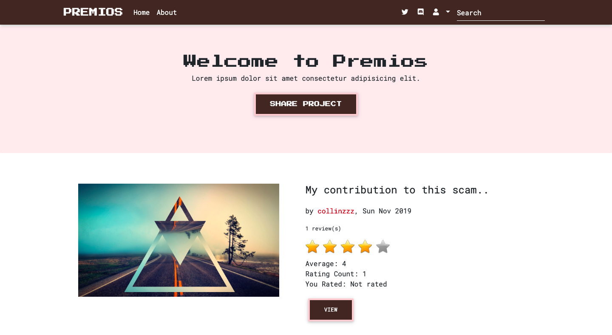

<a href="https://premi0s.herokuapp.com/" target="_blank">
  <h1 align="center">Welcome to premios 👋</h1>
</a>
<p>
  
  <a href="LICENSE" target="_blank">
    
  </a>
  <a href="https://twitter.com/collinsmuriuki_" target="_blank">
    
  </a>
</p>

> An application which allows a user to post a project he/she has created and get it reviewed by his/her peers
> A project can be rated based on 3 different criteria
> 1. Design
> 2. Usability
> 3. Content



## Technologies used

1. Python3
2. SQLite3
3. MDBootstrap
4. jQuery
5. Django

## Requirements

This project requires python3 to run
Instructions on how to install python can be found [here](https://realpython.com/installing-python/)

## Setting up a virtual environement

To create a virtual environement, you will need to install virtualenv
```sh
pip3 install virtualenv
```

Create the virtual environement by running the command in the project root
```sh
virtualenv venv
```

Activate the virtual environement by running the command
```sh
source venv/bin/activate
```

You can always deactivate the virtual environement by entering this command
```sh
deactivate
```

## Usage

Make migrations by using the command
```sh
python manage.py migrate
```

You need to create a .env file and set your secret key inside it. To launch the app, simply run the command
```sh
 python manage.py runserver
```

## Run tests

```sh
python manage.py test
```

## API
Users endpoint

```sh
https://premi0s.herokuapp.com/api/users/
```
Projects endpoint

```sh
https://premi0s.herokuapp.com/api/projects/
```

## Author

👤 **Collins Muriuki**

* Twitter: [@collinsmuriuki_](https://twitter.com/collinsmuriuki_)
* Github: [@collinsmuriuki](https://github.com/collinsmuriuki)

## Show your support

Give a ⭐️ if this project helped you!

***
_This README was generated with ❤️ by [readme-md-generator](https://github.com/kefranabg/readme-md-generator)_