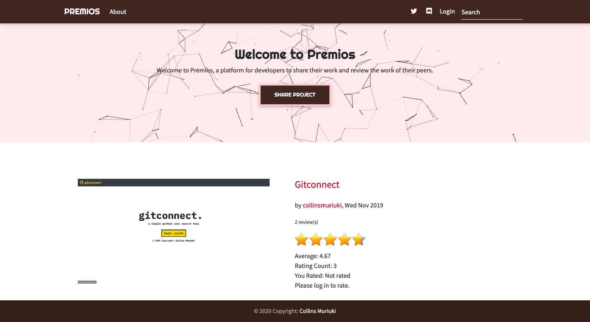

<a href="https://premi0s.herokuapp.com/" target="_blank">
  <h1 align="center">Welcome to premios 👋</h1>
</a>
<p>
  
  <a href="LICENSE" target="_blank">
    
  </a>
  <a href="https://twitter.com/collinsmuriuki_" target="_blank">
    
  </a>
</p>

> An application which allows a user to post a project he/she has created and get it reviewed by his/her peers
> A project can be rated based on 3 different criteria
> 1. Design
> 2. Usability
> 3. Content



## Technologies used

1. Python3
2. SQLite3
3. MDBootstrap 4.8.10
4. jQuery 3.4.1
5. Django 1.11.23
6. three.js JavaScript Graphics
7. [vanta.js](https://github.com/tengbao/vanta)

## Requirements

This project requires python3 to run
Instructions on how to install python can be found [here](https://realpython.com/installing-python/)

## Setting up a virtual environement

To create a virtual environement, you will need to install virtualenv
```sh
pip3 install virtualenv
```

Create the virtual environement by running the command in the project root
```sh
virtualenv venv
```

Activate the virtual environement by running the command
```sh
source venv/bin/activate
```

You can always deactivate the virtual environement by entering this command
```sh
deactivate
```

## Usage

Make migrations by using the command
```sh
python manage.py migrate
```

You need to create a .env file and set your secret key inside it. To launch the app, simply run the command
```sh
 python manage.py runserver
```

## Run tests

```sh
python manage.py test
```

## API
Users endpoint

```sh
https://premi0s.herokuapp.com/api/users/
```
Projects endpoint

```sh
https://premi0s.herokuapp.com/api/projects/
```

Sample GET request response
```sh
[
    {
        "id": 1,
        "username": "collinsmuriuki",
        "email": "murerwacollins@gmail.com",
        "projects": [
            {
                "id": 3,
                "author": 1,
                "title": "Newsroom",
                "description": "<p style=\"box-sizing: border-box; margin-top: 0px; margin-bottom: 16px; color: #24292e; font-family: -apple-system, system-ui, 'Segoe UI', Helvetica, Arial, sans-serif, 'Apple Color Emoji', 'Segoe UI Emoji'; font-size: 16px;\">An application which lists and previews news articles from various sources using the&nbsp;<a style=\"box-sizing: border-box; background-color: initial; color: #0366d6; text-decoration-line: none;\" href=\"https://newsapi.org/\" rel=\"nofollow\">News API</a>, made by python web framework, Flask.</p>\r\n<h2 style=\"box-sizing: border-box; margin-top: 24px; margin-bottom: 16px; line-height: 1.25; padding-bottom: 0.3em; border-bottom: 1px solid #eaecef; color: #24292e; font-family: -apple-system, system-ui, 'Segoe UI', Helvetica, Arial, sans-serif, 'Apple Color Emoji', 'Segoe UI Emoji';\"><a id=\"user-content-features\" class=\"anchor\" style=\"box-sizing: border-box; background-color: initial; color: #0366d6; text-decoration-line: none; float: left; padding-right: 4px; margin-left: -20px; line-height: 1;\" href=\"https://github.com/collinsmuriuki/newsroom#features\"></a>Features</h2>\r\n<p style=\"box-sizing: border-box; margin-top: 0px; margin-bottom: 16px; color: #24292e; font-family: -apple-system, system-ui, 'Segoe UI', Helvetica, Arial, sans-serif, 'Apple Color Emoji', 'Segoe UI Emoji'; font-size: 16px;\">Here are the features in summary:</p>\r\n<ul style=\"box-sizing: border-box; padding-left: 2em; margin-top: 0px; margin-bottom: 16px; color: #24292e; font-family: -apple-system, system-ui, 'Segoe UI', Helvetica, Arial, sans-serif, 'Apple Color Emoji', 'Segoe UI Emoji'; font-size: 16px;\">\r\n<li style=\"box-sizing: border-box;\">A minimalistic landing page showing trending world news and a variety of news sources</li>\r\n<li style=\"box-sizing: border-box; margin-top: 0.25em;\">Clickable news sources which direct the user to a page with article highlights from the particular source.</li>\r\n</ul>",
                "publish_date": "2019-11-27T09:29:03.970181+03:00",
                "project_pic": "https://ucarecdn.com/30ce2629-835c-49a0-ae1a-177027fef7be/",
                "live_site": "https://newsr00m.herokuapp.com/",
                "reviews": []
            },
            {
                "id": 2,
                "author": 1,
                "title": "Gitconnect",
                "description": "<p>gitconnect is an app that allows a user to search for GitHub users and display their profile information as well as a glimpse of their repositories. This app utilises the GitHub API as its backend with the front-end built using Angular.</p>",
                "publish_date": "2019-11-27T09:27:25.342599+03:00",
                "project_pic": "https://ucarecdn.com/33c70e09-4dd6-4929-a6aa-071ff57c88c8/",
                "live_site": "https://gitconnect-ip.firebaseapp.com/",
                "reviews": []
            },
            {
                "id": 1,
                "author": 1,
                "title": "Personal Blog",
                "description": "<p>A simple blog made using Python web microframework, Flask.</p>",
                "publish_date": "2019-11-27T09:26:01.768512+03:00",
                "project_pic": "https://ucarecdn.com/f6d1d33b-0253-473e-9c0f-eb468e5e6447/",
                "live_site": "https://collinsm-blog.herokuapp.com/",
                "reviews": []
            }
        ]
    }
]
```

## Author

👤 **Collins Muriuki**

* Twitter: [@collinsmuriuki_](https://twitter.com/collinsmuriuki_)
* Github: [@collinsmuriuki](https://github.com/collinsmuriuki)

## Show your support

Give a ⭐️ if this project helped you!

***
_This README was generated with ❤️ by [readme-md-generator](https://github.com/kefranabg/readme-md-generator)_